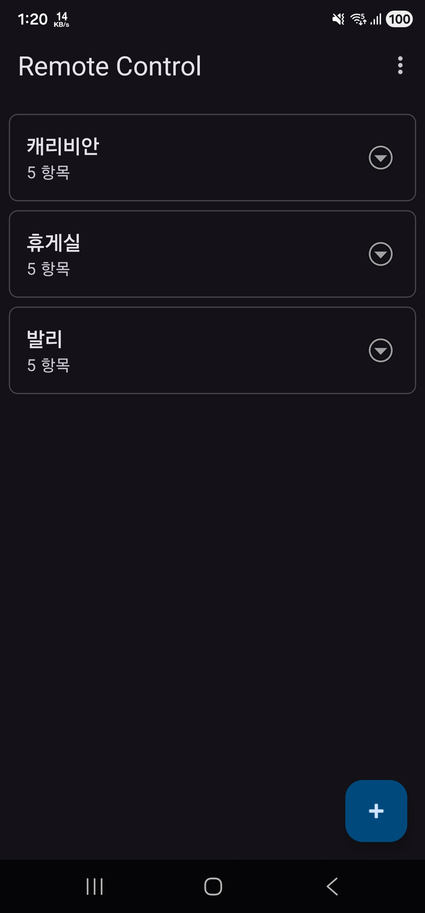
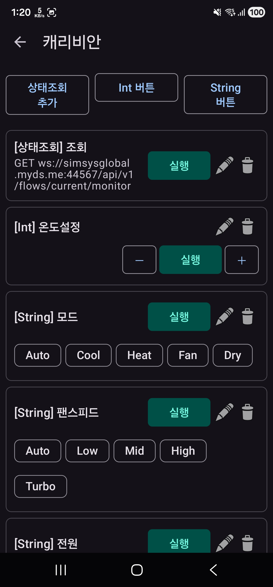
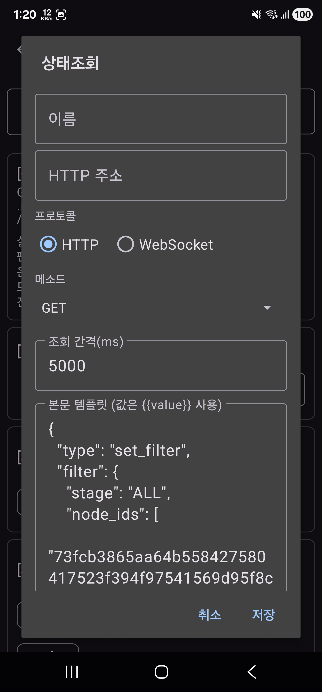
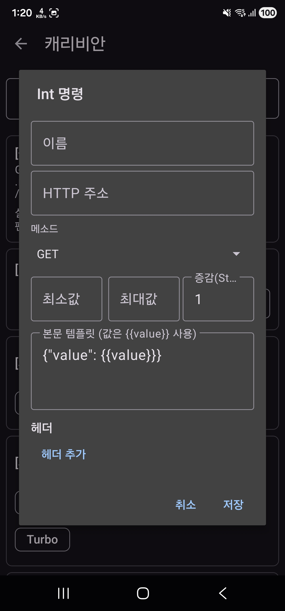
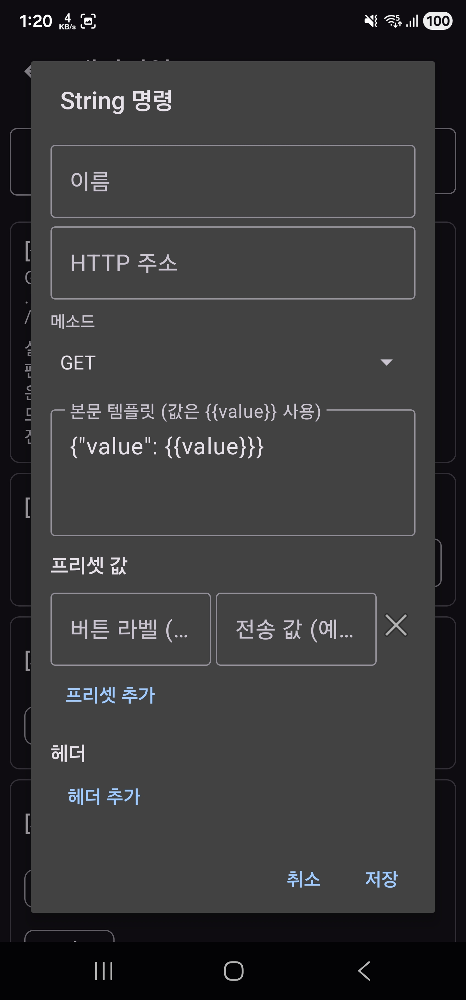

# Remote Control

BACnet/IoT 장비를 휴대폰에서 제어·모니터링하기 위한 안드로이드 앱.
디바이스마다 **상태조회 / Int 명령 / String 명령** 버튼을 자유롭게 등록해서 HTTP 또는 WebSocket으로 송수신합니다.

- Package: `com.lunastratos.remotecontrol`
- minSdk 28, targetSdk 36, Java 11, Kotlin
- Material 3 UI (`Theme.Material3.DayNight.NoActionBar`)

| 디바이스 목록 | 디바이스 상세 |
|---|---|
|  |  |

---

## 주요 기능

### 디바이스 / 항목 관리
- 디바이스 추가/이름 변경/삭제 (메인 화면 우하단 ➕)
- 디바이스마다 항목(버튼)을 N개 등록
- 모든 데이터는 `SharedPreferences`에 JSON으로 영구 저장

### 항목 종류 3가지

상단 **상태조회 추가 / Int 버튼 / String 버튼**으로 만들 수 있습니다.

| 종류 | 설명 |
|---|---|
| **STATUS_QUERY (상태조회)** | HTTP 폴링 또는 WebSocket 구독으로 값을 받아 카드에 표시 |
| **INT_COMMAND (Int 버튼)** | `−` ▶ `+` 스텝 버튼. min/max/step으로 클램프, 본문에 `{{value}}` 치환 |
| **STRING_COMMAND (String 버튼)** | `라벨=값` 프리셋을 칩 버튼으로 표시. 누르면 `{{value}}`에 치환되어 전송. ▶로 자유 입력도 가능 |

`screen2.jpg`에서 보듯, 한 디바이스에 세 종류 카드를 자유롭게 섞어서 둘 수 있습니다 — 상단의 상태조회(WebSocket), 중간의 Int 명령(`온도설정`, − ▶ + 스텝 행), 하단의 String 명령(`모드`/`팬스피드`/`전원`)이 라벨 칩 버튼으로 펼쳐집니다.

### 항목 편집 다이얼로그

세 종류 모두 동일 다이얼로그(`ItemEditDialog`)에서 편집되며, 종류별로 필요한 필드만 노출됩니다.

| 상태조회 | Int 명령 | String 명령 |
|---|---|---|
|  |  |  |

- **상태조회**: 프로토콜(`HTTP / WebSocket`) · 메소드 · 조회 간격 · 본문 템플릿(WS는 구독 페이로드로 자동 사전 입력) · (WS 한정) 응답 경로 · 표시 규칙 · 헤더
- **Int 명령**: 메소드 · 최소값 / 최대값 / 증감(Step) · 본문 템플릿 · 헤더
- **String 명령**: 메소드 · 본문 템플릿 · **프리셋 값(라벨 + 전송 값)** · 헤더

### WebSocket 상태조회 고급 기능
- 연결 직후 자동 송신할 **구독 페이로드** (예: `set_filter` JSON, `screen5.jpg` 참고)
- 단순 추출용 **응답 경로**: `data.envelope.body.Telemetry.payload.F64` 같은 점 경로
- **조건부 표시 규칙(WsRule)**: 메시지의 특정 값이 매칭될 때만 추출, 라벨로 누적
  - 예) `data.node_id == "73fc..."` 이면 `온도: 27.8`로 표시, 다른 노드는 `습도: 65`로 누적

### JSON 가져오기 / 내보내기
- 메인 화면 ⋮ → **JSON 내보내기 / 가져오기**
- 가져오기 다이얼로그에서 URL 입력 후 **주소에서 가져오기**로 원격 JSON 자동 다운로드
- 전체 교체 / id 기준 병합 선택 가능

### 설정 화면
메인 화면 ⋮ → **설정**

- **JSON 가져오기 기본 주소** — 가져오기 다이얼로그 사전 입력값
- **로그 보기** — WS 연결/오류/종료 라인 표시 여부 (기본 OFF)
- **URL 안보기** — Int/String 명령 카드에서 메소드+URL 부제 숨김

---

## 빌드 / 실행

```bash
# 디버그 APK
./gradlew assembleDebug

# 디바이스에 설치 (USB 디버깅 활성 상태)
./gradlew installDebug
```

Android Studio에서 열어 그대로 Run 가능. `local.properties`에 `sdk.dir`만 맞춰져 있으면 됩니다.

---

## 프로젝트 구조

```
app/src/main/
├── java/com/lunastratos/remotecontrol/
│   ├── MainActivity.kt                      # 디바이스 목록
│   ├── DeviceDetailActivity.kt              # 디바이스 안의 항목 카드 + WS/HTTP 폴링
│   ├── SettingsActivity.kt                  # 설정 화면
│   ├── data/
│   │   ├── Device.kt                        # 디바이스 모델
│   │   ├── DeviceItem.kt                    # 항목 모델 + WsRule + StringPreset
│   │   ├── DeviceRepository.kt              # SharedPrefs + Gson (legacy 호환 디시리얼라이저)
│   │   └── Settings.kt                      # 설정 (logs / importUrl / hideUrl)
│   ├── net/
│   │   ├── HttpExecutor.kt                  # OkHttp GET/POST/PUT/PATCH/DELETE + fetchText
│   │   └── WsExecutor.kt                    # OkHttp WebSocket (헤더, ping, 구독 페이로드)
│   ├── ui/
│   │   ├── DeviceAdapter.kt                 # 메인 화면 디바이스 카드
│   │   ├── DeviceItemAdapter.kt             # 항목 카드 (Run / +- / 칩 / 결과)
│   │   ├── ItemEditDialog.kt                # 항목 편집 다이얼로그
│   │   └── SimpleInputDialog.kt             # 단일 텍스트 입력 다이얼로그
│   └── util/
│       └── JsonPathUtil.kt                  # 점 경로로 JSON 값 추출 (배열 인덱스 지원)
└── res/
    ├── layout/                              # 모든 화면/카드/다이얼로그 레이아웃
    ├── menu/menu_main.xml                   # 메인 ⋮ 메뉴 (export/import/설정)
    ├── values/
    │   ├── colors.xml                       # M3 토널 팔레트 (light)
    │   ├── strings.xml                      # 한국어 문자열
    │   └── themes.xml                       # Theme.Material3 + 사각 버튼 스타일
    └── values-night/                        # 다크 모드 색/테마
```

---

## JSON 데이터 구조

내보내기/가져오기는 동일하게 **`Device` 배열**입니다.

```jsonc
[
  {
    "id": "uuid (선택, 없으면 자동 생성)",
    "name": "캐리비안",
    "items": [
      {
        // 공통
        "id": "uuid (선택)",
        "type": "STATUS_QUERY" | "INT_COMMAND" | "STRING_COMMAND",
        "name": "표시 이름",
        "url": "http(s):// 또는 ws(s)://...",
        "method": "GET" | "POST" | "PUT" | "PATCH" | "DELETE",
        "headers": [{ "key": "Authorization", "value": "Bearer xxx" }],
        "bodyTemplate": "{{value}} 자리표시자 사용",

        // STATUS_QUERY 전용
        "protocol": "HTTP" | "WEBSOCKET",
        "intervalMs": 5000,
        "responsePath": "data.envelope.body.Telemetry.payload.F64",
        "wsRules": [
          {
            "label": "온도",
            "matchPath": "data.node_id",
            "matchValue": "73fc...",
            "valuePath": "data.envelope.body.Telemetry.payload.F64"
          }
        ],

        // INT_COMMAND 전용
        "intMin": 10,
        "intMax": 35,
        "intStep": 1,

        // STRING_COMMAND 전용
        "stringPresets": [
          { "label": "Auto", "value": "0" },
          { "label": "Cool", "value": "1" },
          { "label": "Heat", "value": "2" }
        ]
      }
    ]
  }
]
```

### 호환성
- 모든 신규 필드(`protocol`, `responsePath`, `wsRules`, `intStep`, `stringPresets`)는 누락되면 기본값으로 채워집니다 — 옛 JSON 그대로 가져와도 동작.
- `stringPresets`는 과거 `["heat","cool"]` 같은 단순 문자열 배열도 자동으로 `{label: "heat", value: "heat"}`로 마이그레이션됩니다 (`DeviceRepository.StringPresetDeserializer`).

---

## 사용 예시

### 1. WebSocket 구독으로 여러 노드 동시 모니터링

설정 (스크린샷 `screen5.jpg` 참고):
- URL: `ws://simsysglobal.myds.me:44567/api/v1/flows/current/monitor`
- 프로토콜: **WebSocket**
- 전송 메시지:
  ```json
  {"type":"set_filter","filter":{"stage":"ALL","node_ids":["73fc...","abcd..."]}}
  ```
- 표시 규칙 2개:
  - 라벨 `온도` / 매칭 `data.node_id == 73fc...` / 값 `data.envelope.body.Telemetry.payload.F64`
  - 라벨 `습도` / 매칭 `data.node_id == abcd...` / 값 `data.envelope.body.Telemetry.payload.F64`

결과 카드 표시 (자동 누적):
```
온도: 27.799999237060547
습도: 65.2
```

### 2. Int 버튼으로 목표 온도 조절

스크린샷 `screen3.jpg`처럼 최소/최대/증감을 지정 → 카드의 `−`/▶/`+`을 눌러 값을 step만큼 가감 → POST로 전송.
경계에 도달하면 토스트 안내, 요청 생략.

### 3. String 버튼 프리셋 — 에어컨 모드/팬스피드 같은 다중 옵션

스크린샷 `screen2.jpg`의 `[String] 모드`처럼:
- 프리셋: `Auto=0`, `Cool=1`, `Heat=2`, `Fan=3`, `Dry=4`
- 카드 하단에 `[Auto] [Cool] [Heat] [Fan] [Dry]` 칩 버튼 자동 렌더링 (자동 줄바꿈)
- 칩을 누르면 `{"value": 1}` 형태로 즉시 전송, ▶는 자유 입력 폴백

---

## 권한 / 보안 메모

- `INTERNET` 권한만 사용
- `usesCleartextTraffic="true"` — `http://` 및 `ws://` 평문 호출 허용. 운영 환경이라면 매니페스트에서 끄고 `https`/`wss`만 사용하는 것을 권장
- 인증 토큰은 헤더에 평문으로 저장됨 — JSON을 공유할 때 토큰을 빼고 전달
- 데이터 백업 룰: `res/xml/backup_rules.xml`, `data_extraction_rules.xml`
